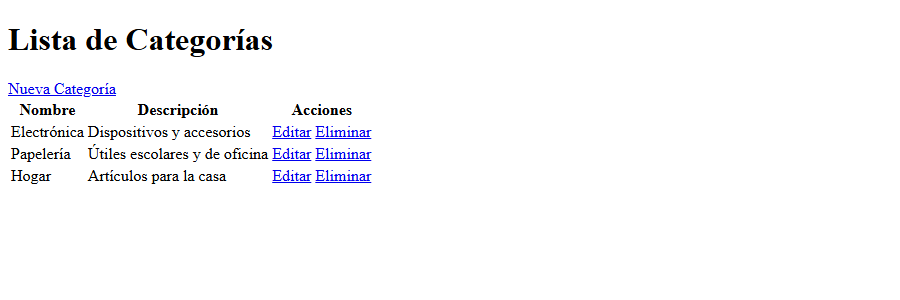
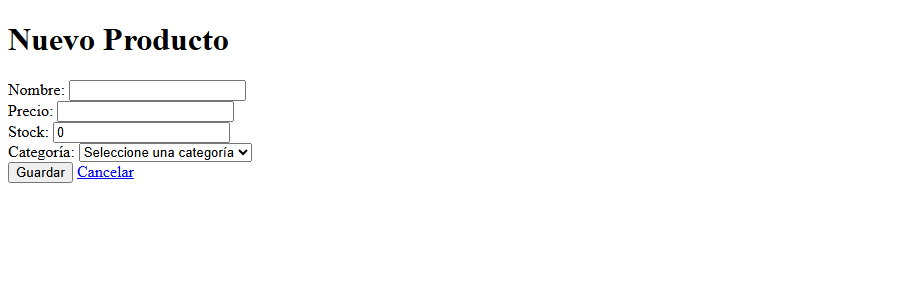
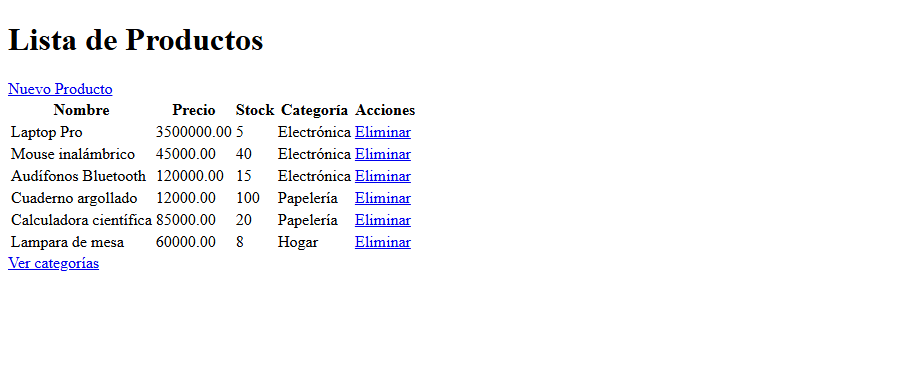
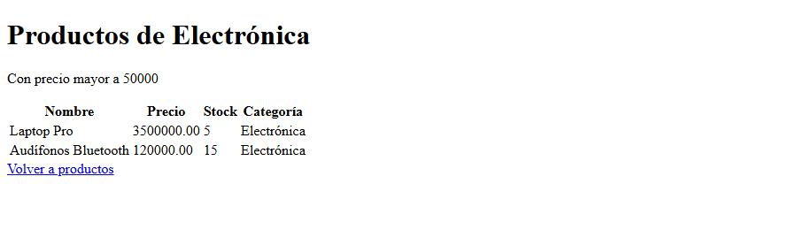

# Post-contenido Unidad 8: persistencia con JPA/Hibernate

## Descripción
Repositorio del laboratorio de la Unidad 8 de Programación Web (séptimo semestre). Contiene un único proyecto Maven Spring Boot, `catalogo-jpa/`, que modela el catálogo de un pequeño comercio. La Parte 1 implementa un CRUD de categorías con Spring Data JPA e Hibernate contra MySQL. La Parte 2 extiende el mismo proyecto con la entidad Producto, una relación `@ManyToOne`/`@OneToMany` hacia Categoria y una consulta JPQL personalizada.

## Parte 1: CRUD de Categoría con JPA/Hibernate y MySQL
`CategoriaController`, `CategoriaService` y `CategoriaRepository` (un `JpaRepository`) gestionan la entidad Categoria, que Hibernate persiste en MySQL. Hay listado, registro, edición y eliminación, con validación de campos (`@NotBlank`, `@Size`), nombre único y plantillas Thymeleaf (`lista.html`, `formulario.html` y `confirmar-eliminar.html`).

## Parte 2: relación @ManyToOne/@OneToMany con Producto
La entidad Producto tiene una relación `@ManyToOne` hacia Categoria (columna `categoria_id`, con `FetchType.LAZY` explícito) y Categoria guarda el lado inverso con `@OneToMany(mappedBy = "categoria")`. `ProductoRepository` incluye `buscarPorCategoriaConPrecioMayorA`, una consulta JPQL con `@Query` y `JOIN FETCH` que devuelve los productos de una categoría con precio mayor a un valor dado en una sola sentencia SQL.

Relación entre las entidades:

```
Categoria (1) ----< Producto (N)
```

## Funcionalidades implementadas
- Listar, crear, editar y eliminar categorías, con confirmación antes de eliminar.
- Validación de categorías: nombre obligatorio de 2 a 80 caracteres, descripción de hasta 250 y nombre único sin distinguir mayúsculas.
- Listar, crear y eliminar productos, cada uno asociado a una categoría.
- Validación de productos: nombre obligatorio, precio mayor a cero y stock no negativo.
- Listado de productos con el nombre de su categoría.
- Consulta de los productos de una categoría con precio mayor a un valor dado, ordenados de mayor a menor precio.
- Rechazo del borrado de una categoría que todavía tiene productos asociados.

## Configuración de la base de datos
Se necesita MySQL 8.x en el puerto 3306.

1. Crear la base de datos y el usuario en MySQL:
   `CREATE DATABASE catalogo_db CHARACTER SET utf8mb4 COLLATE utf8mb4_unicode_ci;`
   `CREATE USER "appuser"@"localhost" IDENTIFIED BY "apppass";`
   `GRANT ALL PRIVILEGES ON catalogo_db.* TO "appuser"@"localhost";`
2. Revisar `catalogo-jpa/src/main/resources/application.properties`, que ya apunta a `catalogo_db` con el usuario `appuser`. Si tu MySQL usa otras credenciales, cambia `spring.datasource.url`, `spring.datasource.username` y `spring.datasource.password`. Hibernate crea las tablas solas al arrancar (`ddl-auto=update`).

## Decisiones de diseño
- `ddl-auto=update` en lugar de `create`: conserva los datos de prueba entre reinicios mientras se agregaban las entidades de ambas partes. `create` borraría y recrearía las tablas en cada arranque.
- Nombre único en Categoria: la columna es `unique` y además `CategoriaService` lo valida antes de guardar, para mostrar un mensaje legible en el formulario en lugar de una excepción de la base de datos.
- `FetchType.LAZY` explícito en `Producto.categoria`: JPA carga `@ManyToOne` de forma EAGER por defecto, y casi ninguna operación sobre productos necesita la categoría completa. Las vistas que sí muestran el nombre de la categoría usan `JOIN FETCH` en el repositorio, así que no hay `LazyInitializationException` ni consultas N+1.
- Sin `cascade = REMOVE` de Categoria hacia Producto: borrar una categoría con productos borraría todo en silencio. `CategoriaService.eliminar` rechaza la operación con un mensaje y obliga a reasignar o eliminar los productos antes. Se prioriza la integridad de los datos sobre la comodidad de un borrado en un solo paso.
- `CategoriaController` captura los errores de negocio del servicio (nombre duplicado y categoría con productos) y los muestra en pantalla, en lugar de dejar que lleguen al navegador como un error 500.

## Cómo compilar y ejecutar
1. Clonar el repositorio: `git clone https://github.com/julianejurado-rgb/jurado-post1-u8.git`
2. Crear la base de datos `catalogo_db` en MySQL (ver arriba).
3. Revisar las credenciales en `catalogo-jpa/src/main/resources/application.properties`.
4. Ejecutar `./mvnw spring-boot:run` dentro de `catalogo-jpa/`.
5. Parte 1: abrir `http://localhost:8080/categorias`. Parte 2: abrir `http://localhost:8080/productos`.

La consulta filtrada de la Parte 2 se prueba con una URL como `http://localhost:8080/productos/categoria/1/precio-mayor?minimo=50000`, donde `1` es el id de la categoría.

## Capturas de pantalla
Lista de categorías:



Formulario de producto:



Lista de productos con su categoría:



Productos de la categoría Electrónica con precio mayor a 50000:


